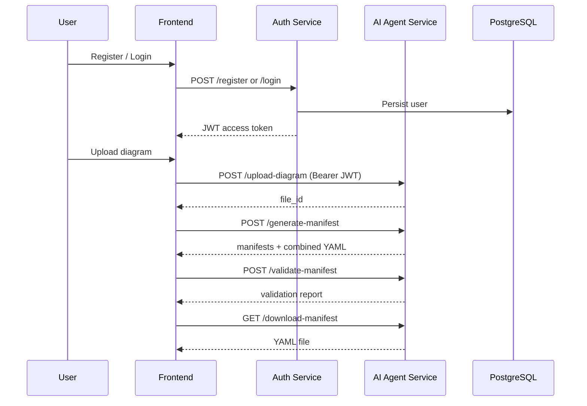

# Architecture

## Overview

The platform converts Kubernetes architecture diagrams into validated YAML manifests using a simple three-tier layout:

1. **Frontend** (React + Vite) — user interface
2. **Auth Service** (FastAPI) — registration, login, JWT issuance
3. **AI Agent Service** (FastAPI) — diagram upload, manifest generation, validation

## Data Flow

## Security

- Passwords hashed with bcrypt
- JWT signed with shared `JWT_SECRET_KEY`
- AI endpoints require valid Bearer token
- Manifest access scoped by user email in metadata

## LLM Modes

| Mode | When | Behavior |
|------|------|----------|
| Mock | `USE_MOCK_LLM=true` or no API key | Deterministic component inference |
| OpenAI | API key configured | LangChain + ChatOpenAI analysis |

## Validation Pipeline

1. YAML syntax (`PyYAML`)
2. kube-score (optional CLI)
3. kube-linter (optional CLI)
